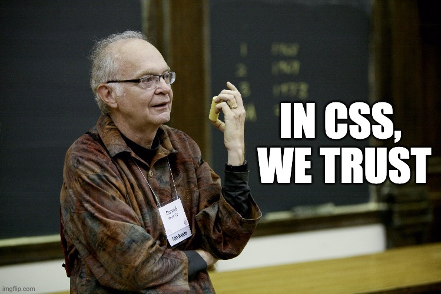

# IFCD65
Repositorio de la formación 🌐 **IFCD65: Front End Web Developer** 🌐

🔥 = nuevo

**Nuevo:** 🔥 [Playground](./playground.md) 🔥

---

**Fechas importantes:** 25 de marzo

- Entregable 1 (Git y Github):
- Entregable 2 (HTML):
- Entregable 3 (CSS):
- Entregable 4 (JS):

## Documentación del curso

- [BOE del IFCD65](https://sede.sepe.gob.es/es/portaltrabaja/resources/pdf/especialidades/IFCD65.pdf)
- Calendario: **pendiente**
- Carpeta en Google Drive (compartida en las sesiones)

## IFCD65 Front-end Web Developer

  - [¿Qué es el front-end?](./posts/01.que-es-el-front-end.md)
  - [¿Solo centramos divs?](./posts/02.solo-centramos-divs.md)
  - [El futuro del front-end](./posts/03.el-futuro-del-front-end.md)

### Cómo usar este repositorio

Este repositorio contiene mi interpretación del temario propuesto para el curso
**IFCD65 Front End Web Developer** adaptado a la actualidad del mercado laboral.

Puedes hacer uso del contenido para aprender sobre estos temas y hacer los ejercicios
para practicar. A continuación, indico el uso recomendado de este contenido:

- **Primera parte:** si es tu primera vez en programación, deberías revisar los primeros
temas sobre [ordenadores](./diapositivas/00.ordenadores/) y cómo [configurar Visual Code](./diapositivas/00.visual-code/). También, deberás [instalar Git](./instalacion-git.md).
- **Control de cambios:** antes de entrar en materia de front-end, recomiendo aprender a usar control de cambios con Git y 
el uso de Github para compartir proyectos o colaborar. [Git y Github](./diapositivas/01.control-de-cambios/)
- **Front-end:** las tecnologías principales de front-end en la web son HTML, CSS, Javascript y la librería React nos permite crear componentes para hacer interfaces de forma escalable.

  - [HTML](./diapositivas/02.html/)
  - [CSS](./diapositivas/03.css/)
  - [JS](./diapositivas/04.js/)
  - [React](./diapositivas/05.react/)

- **Proyecto final:** además de hacer un [portafolio](./portafolio.md) y el [CV](./cv.md) también recomiendo un buen [perfil en Github](./perfil-github.md) y [Linkedin](./perfil-linkedin.md). Finalmente, en este curso hacemos un proyecto final usando todas las tecnologías estudiadas.

  - [Proyecto Final](./diapositivas/99.proyecto-final/)
  - URL: TBD

---

## Temario

### Control de cambios (Git y Github)

- [Libro de midudev](https://aprendiendogit.com/)
- Repositorio de git: 
  - [learn-git](https://github.com/cesarlpb/learn-git), [en rama ifcd65](https://github.com/cesarlpb/learn-git/tree/ifcd65)
    - [ejercicios de Git](https://github.com/cesarlpb/learn-git/tree/ifcd65/ejercicios)
- 🔥 Diapositivas: [Git y Github](./diapositivas/01.control-de-cambios/)
- Libro oficial:
  - [Libro oficial en español](https://git-scm.com/book/es/v2)
  - [Libro oficial en inglés](https://git-scm.com/book/en/v2)
- [Git/Github en W3schools (inglés con opción a traducir)](https://www.w3schools.com/git/default.asp)

### HTML

- 🔥 Libro: [HTML5Book (disponible gratis online en inglés pra descarga)](https://goalkicker.com/HTML5Book/)
- 🔥 Diapositivas: [HTML](./diapositivas/02.html/)
- 🔥 W3schools: https://www.w3schools.com/html/default.asp

### CSS

- 🔥 Libro: [CSSBook (disponible gratis online en inglés pra descarga)](https://goalkicker.com/CSSBook/)
- 🔥 Diapositivas: [CSS](./diapositivas/03.css/)
- 🔥 W3schools: https://www.w3schools.com/css/default.asp

### JS 

- 🔥 Libro: [Eloquent JS (inglés, parcial en español)](https://eloquentjavascript.net/)
- 🔥 Diapositivas: [JS](./diapositivas/04.js/)
- 🔥 W3schools: https://www.w3schools.com/js/default.asp

### React 

- 🔥 Docs: [Documentación oficial de React (inglés y español)](https://react.dev/learn) 
- 🔥 Diapositivas: [JS](./diapositivas/05.react/)
- 🔥 W3schools: https://www.w3schools.com/react/default.asp

### Tutoriales

  1. [Subir página a Github Pages](./tutoriales/01.como-publicar-en-github-pages.md)
  2. [Publicar en Vercel](./tutoriales/02.como-publicar-en-vercel.md)
  3. [Publicar con HTTPS en Linux](./tutoriales/03.como-publicar-en-linux.md)
  4. [Páginas para publicar gratis usando React](./tutoriales/04.publicar-gratis-en-react.md)
  5. [Recomendaciones para subir página a producción](./tutoriales/05.checklist-para-publicar-en-produccion.md)

