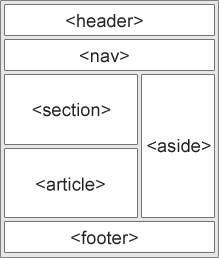
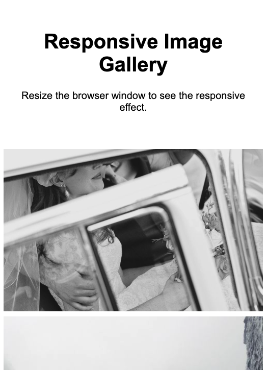
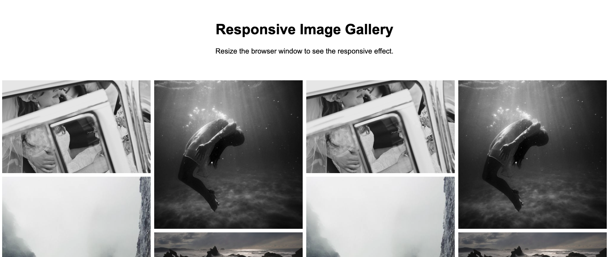

# Entregable 02: Diseño Responsive con HTML y CSS

**HTML** y **CSS** son las tecnologías base para hacer páginas web.

Por este motivo, el objetivo de estos ejercicios es comprobar el entendimiento
del diseño y maquetación de páginas *responsive* (cuyo diseño y estructura funciona
en diversos tamaños de pantalla: desktop, tablet, mobile).

---

**Nota:** Se puede usar este mismo documento para documentar las soluciones mediante anotaciones y capturas.

## Primera parte: Estructura semántica de HTML

**📌 Contexto:**

Ejercicios del itinerario de diseño responsive de FreeCodeCamp

- [Certificado de Diseño Web Responsive](https://www.freecodecamp.org/learn/2022/responsive-web-design/)
  - [Survey Form (encuesta)](https://www.freecodecamp.org/learn/2022/responsive-web-design/build-a-survey-form-project/build-a-survey-form)
  - [Página de Tributo (sobre algún personaje o persona célebre)](https://www.freecodecamp.org/learn/2022/responsive-web-design/build-a-tribute-page-project/build-a-tribute-page)
  - [Página de Documentación](https://www.freecodecamp.org/learn/2022/responsive-web-design/build-a-technical-documentation-page-project/build-a-technical-documentation-page)
  - [Landing page de producto](https://www.freecodecamp.org/learn/2022/responsive-web-design/build-a-product-landing-page-project/build-a-product-landing-page)
  - [Portafolio](https://www.freecodecamp.org/learn/2022/responsive-web-design/build-a-personal-portfolio-webpage-project/build-a-personal-portfolio-webpage)

### **Ejercicio 1: crear una estructura de etiquetas semánticas en HTML**  

- [Semántica en HTML](https://www.w3schools.com/html/html5_semantic_elements.asp)

Plantillas:
- [W3schools template](https://www.w3schools.com/html/html_responsive.asp)
- [W3schools Flex Template](https://www.w3schools.com/Css/css3_flexbox_responsive.asp)
- [W3schools Responsive Templates](https://www.w3schools.com/Css/css_rwd_templates.asp)

--- Solución del ejercicio 1 (capturas y comentarios) ---

- Elige 1 de los 5 ejercicios del itinerario de [Responsive Web Design](https://www.freecodecamp.org/learn/2022/responsive-web-design/) de FreeCodeCamp para este ejercicio
- Escribe aquí la solución
- Si quieres enlazar un archivo, puedes usar [solución 01](./archivo.md)

--------------------------------------------------------------------------------

### **Ejercicio 2: diseño mobile first**  

El diseño se debe pensar para funcionar en móvil primero y a partir de este diseño inicial ampliamos los estilos para tablet y desktop.

- [Plantilla de media queries #1](https://gist.github.com/gokulkrishh/242e68d1ee94ad05f488)
- [Plantilla de media queries #2](https://gist.github.com/mavieth/e0c8fdcb72a30d85f57a)

**Mobile:**

**Desktop:**

Además de los tests de FreeCodeCamp para el ejercicio, se valorará los estilos:

- [ ] El diseño debe ser adecuado para una pantalla móvil
- [ ] El diseño debe permitir el uso correcto de la página en mobile
- [ ] El diseño debe funcionar correctamente en pantallas desktop 

--- Solución del ejercicio 2 (capturas y comentarios) ---

- Elige 1 de los 5 ejercicios del itinerario de [Responsive Web Design](https://www.freecodecamp.org/learn/2022/responsive-web-design/) de FreeCodeCamp para este ejercicio
- Escribe aquí la solución
- Si quieres enlazar un archivo, puedes usar [solución 02](./archivo.md)

--------------------------------------------------------------------------------

### **Ejercicio 3: página responsive con SEO**  

El objetivo de este ejercicio es hacer que nuestra página tenga las etiquetas &lt; meta &gt; correctas para el SEO.

- [Etiquetas meta en W3schools](https://www.w3schools.com/tags/tag_meta.asp)
- [Más sobre etiquetas meta](https://blog.hubspot.com/marketing/meta-tags)
- [Generador de meta tags](https://metatags.io/)

--- Solución del ejercicio 3 (capturas y comentarios) ---

- - Elige 1 de los 5 ejercicios del itinerario de [Responsive Web Design](https://www.freecodecamp.org/learn/2022/responsive-web-design/) de FreeCodeCamp para este ejercicio
- Escribe aquí la solución
- Si quieres enlazar un archivo, puedes usar [solución 03](./archivo.md)

--------------------------------------------------------------------------------

## Entrega

- En el formulario de entrega (Google Forms), sube un **ZIP** de tu repositorio local con los ejercicios de Git.  

  - Formulario: [Formulario de entrega en Gogle Forms](#)
  - Fecha de entrega: 05-03-2025 15:00 (orientativo)

- En el formulario, coloca el **enlace al Pull Request**.  

- En la sección de observaciones, puedes escribir cualquier comentario adicional sobre tu experiencia.  

--- Solución del ejercicio 3 (capturas y comentarios) ---

- Escribe aquí la solución
- Si quieres enlazar un archivo, puedes usar [solución 03](./archivo.md)

--------------------------------------------------------------------------------

### **📩 Entrega**  
- 📂 **Subir ZIP** con el repositorio local de los ejercicios de Git.  
- 🔗 **Colocar el enlace al Pull Request en GitHub**.  
- 📧 **Incluir su email** en el formulario.  
- 📝 **(Opcional) Dejar observaciones sobre el ejercicio**.  

---

¡Ya está! 🚀