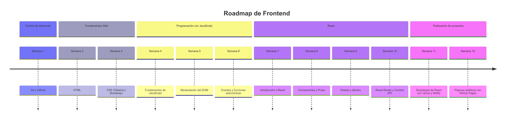

# Recursos

Listado de recursos educativos por temas.

## HTML

- [Libro de HTML para descarga (ENG)](https://books.goalkicker.com/HTML5Book/)
- Online: [HTML en W3schools (ENG // disponible traducción automática en navegador)](https://www.w3schools.com/html/default.asp)

## CSS

- [Libro de CSS para descarga (ENG)](https://books.goalkicker.com/CSSBook/)
- Online: [CSS en W3schools (ENG // disponible traducción automática en navegador)](https://www.w3schools.com/css/default.asp)

## Javascript / JS

- [Libro de Javascript para descarga (ENG)](https://books.goalkicker.com/JavaScriptBook/)
- Online: [JS en W3schools (ENG // disponible traducción automática en navegador)](https://www.w3schools.com/js/default.asp)

## Typescript / TS

- [Libro de Typescript para descarga (ENG)](https://books.goalkicker.com/TypeScriptBook2/)
- Online: [Typescript en W3schools (ENG // disponible traducción automática en navegador)](https://www.w3schools.com/typescript/default.asp)

## React
- [Libro de React para descarga (ENG)](https://books.goalkicker.com/ReactJSBook/)
- Online: [React en W3schools (ENG // disponible traducción automática en navegador)](https://www.w3schools.com/react/default.asp)

## Python

- [Libro de Python para descarga (ENG)](https://books.goalkicker.com/PythonBook/)
- Online: [HTML en W3schools (ENG // disponible traducción automática en navegador)](https://www.w3schools.com/html/default.asp)

## VS Code

- [Manual de introducción a VS Code de Microsoft para lectura online (ENG)]([text](https://microsoft.github.io/vscode-essentials/en/))
  - [Repositorio del manual](https://github.com/microsoft/vscode-essentials)

### Emmet

- [Emmet Cheatsheet (ENG)](https://www.freecodecamp.org/news/write-html-css-faster-with-emmet-cheat-codes/)

## Front-end

```bash
  # Diagrama Mermaid
  timeline
      title Roadmap de Frontend (12 semanas)
      section Control de Versiones
          Semana 1 : Git y GitHub
      section Fundamentos Web
          Semana 2 : HTML
          Semana 3 : CSS (Tailwind y Bootstrap)
      section Programación con JavaScript
          Semana 4 : Fundamentos de JavaScript
          Semana 5 : Manipulación del DOM
          Semana 6 : Eventos y funciones asincrónicas
      section React
          Semana 7 : Introducción a React
          Semana 8 : Componentes y Props
          Semana 9 : Estado y efectos
          Semana 10 : React Router y Context API
      section Publicación de proyectos
          Semana 11 : Despliegue de React con Vercel y Netlify
          Semana 12 : Páginas estáticas con GitHub Pages
```



### Certificados de FreeCodeCamp

- [Responsive Web Design](https://www.freecodecamp.org/learn/2022/responsive-web-design/)