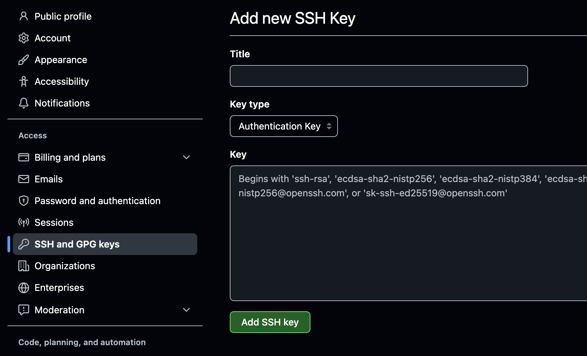
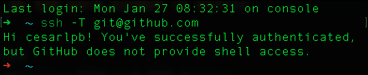

<!-- Grabación del día 29.01 entre las 12:00 - 12:30 -->
# **📌 Guión: Introducción a GitHub (30 min)**  

## **1️⃣ ¿Qué es GitHub? (5 min)**
📌 **Objetivo:** Explicar qué es GitHub y por qué se usa con Git.  

✅ **Puntos clave:**  
- GitHub es una **plataforma de almacenamiento y colaboración** para proyectos Git.  
- Permite trabajar en equipo, gestionar código y revisar cambios.  
- Usa **repositorios remotos** para almacenar código en la nube.  

📌 **Ejemplo real:**  
- Google Docs permite editar documentos en equipo.  
- GitHub permite hacer lo mismo con código usando Git.  

---

## **2️⃣ Configuración de SSH para GitHub (5 min)**
📌 **Objetivo:** Configurar autenticación sin necesidad de ingresar credenciales manualmente.  

✅ **Generar clave SSH:**  
```bash
ssh-keygen
```
✅ **Copiar la clave pública:**  
```bash
#  Linux / Mac
cat ~/.ssh/id_rsa.pub
# Windows
xclip ~/.ssh/id_rsa.pub
# o
code ~/.ssh/id_rsa.pub
```
✅ **Añadir en GitHub:**  
1. Ir a **GitHub > Settings > SSH and GPG keys**.  
2. Click en **New SSH Key** y pegar la clave pública.  



✅ **Verificar conexión:**  

```bash
ssh -T git@github.com
```



💡 **Consejo:** Explicar la diferencia entre clave pública y privada.  

---

## **3️⃣ Subiendo un repositorio local a GitHub (10 min)**
📌 **Objetivo:** Enseñar cómo conectar un repositorio local con GitHub.  

✅ **Crear un repositorio en GitHub (sin `README.md`).**  => [repo.new/](htpps://repo.new) o [Crear repositorio nuevo](https://github.com/new/)


✅ **Conectar repositorio local con GitHub:**  
```bash
git remote add origin git@github.com:usuario/mi_repositorio.git
git branch -M main
git push -u origin main
```
💡 **Consejo:** Explicar `origin` como el nombre del repositorio remoto.  

---

## **4️⃣ Clonar un repositorio de GitHub (5 min)**
📌 **Objetivo:** Explicar cómo descargar un repositorio de GitHub a la máquina local.  

✅ **Clonar un repositorio existente:**  
```bash
git clone git@github.com:usuario/repo.git
cd repo
```
💡 **Consejo:** Explicar la diferencia entre `git clone` y `git pull`.  

---

## Flujo de trabajo recomendado para nuevo repositorio

```bash
  1. Crear repositorio en Github
  2. Clonar con SSH
  3. Empezar a trabajar (pull, push...)
```
---

## **5️⃣ Actualizar cambios entre local y remoto (5 min)**
📌 **Objetivo:** Explicar cómo subir y bajar cambios entre GitHub y la máquina local.  

✅ **Subir cambios a GitHub:**  
```bash
git add .
git commit -m "Nuevo cambio"
git push origin main
```
✅ **Actualizar cambios desde GitHub:**  
```bash
git pull origin main
```
💡 **Consejo:** Explicar la importancia de `git pull` antes de `git push`.  

---

## **6️⃣ Cierre y Preguntas (5 min)**
📌 **Objetivo:** Resolver dudas y reforzar conceptos.  

✅ **Resumen rápido:**  
- `git clone` → Clonar un repositorio  
- `git remote add origin` → Conectar con GitHub  
- `git push` → Subir cambios  
- `git pull` → Descargar cambios  

**💬 Preguntas:**  
- ¿Dudas sobre conexión SSH o sincronización con GitHub?  
- ¿Quieres hacer una práctica en vivo?  
