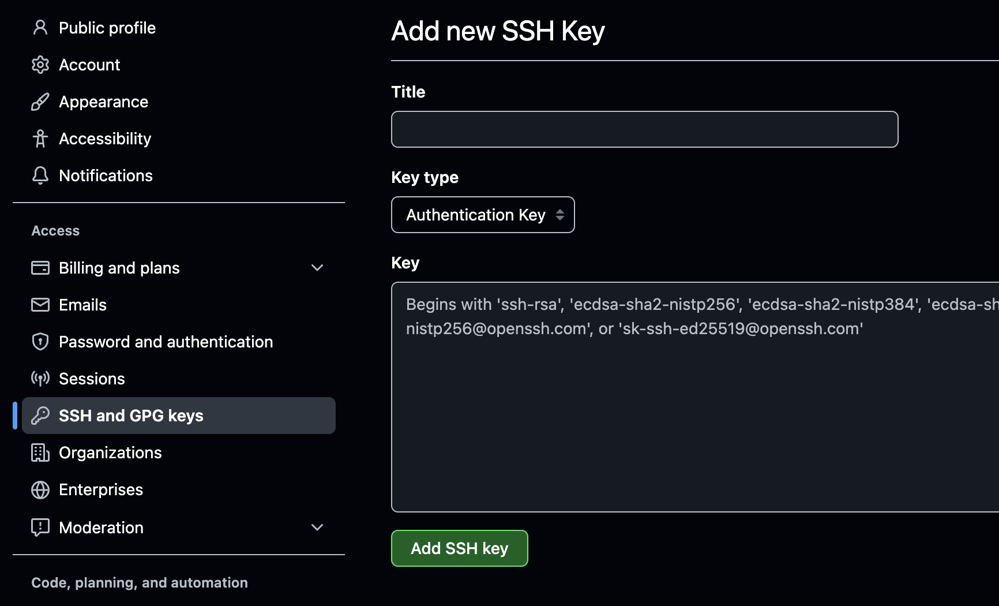
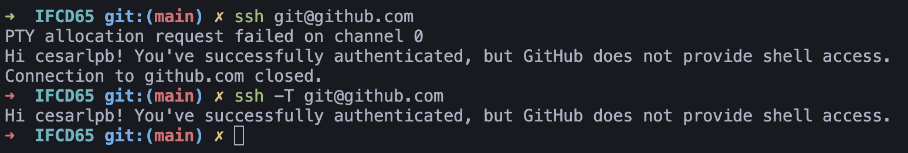

# Preguntas

## ¿Qué te gustaría repasar en clase?

- Interacción con GitHub (configuración SSH, vinculación con repositorio local).
  - Tema del libro "Configurar SSH en Github"
  
  - **Pasos:**
    
    - Abres un Terminal, en Windows es Símbolo del Sistema o CMD
    - Generar el par de llaves: `ssh-keygen` -> Enter hasta el final
      - Sale una ruta donde está la llave pública `... .pub` (importante el .pub)
    - Añadimos la llave en Github (desde Ajustes > SSH y GPG...)
    
    
    
    **Title:** Descripción de la máquina (no se usa para nada, solo informativo)
    **Key:**   Llave **pública**, la del `.pub`

    Comprobación:

    ```
    ssh -T git@github.com
    ```

    - Si pide confiar en Github -> Sí o Yes + Enter
    - Debe salir algo como esto:

    

- Resumen general de Git y GitHub (repaso rápido de lo visto hasta ahora).
- Todo Git (desde lo básico hasta lo más utilizado en el día a día).

- CI/CD (introducción a la integración y entrega continua). => veremos Github Pages durante el tema de HTML

- Lo mínimo e imprescindible para rendir en un puesto de trabajo. 
  
  - Git:    clonar, pull, push, añadir/quitar staging
  - Github: crear repositorio, subir cambios, bajar cambios
    - Recomendable: forks y pull request
  - Configurar SSH

  Bastante recomendable: saber hacerlo por GUI (haciendo clicks) y por terminal

## ¿Qué tema te vendría bien volver a ver?

- SSH y vincular repositorio local con GitHub.
- Branches (ramas en Git).
- Comandos básicos de Git y GitHub (add, commit, push, pull, etc.).
- Cómo eliminar archivos en Git (git rm).
- Configuración inicial en GitHub (incluyendo .gitignore).
## JavaScript (JS).

## ¿Alguna sugerencia?
- Evitar desviaciones en temas avanzados que puedan confundir a quienes tienen menos experiencia.
- Hacer un repaso organizado y conciso sin desviarse en otros temas.
- Explicar comandos de principio a fin sin interrumpirse con otros temas.
- Realizar más ejercicios interactivos y correcciones en grupo.
- Dedicar tiempo a practicar lo aprendido en clase.
- Aprender CI/CD de forma secuencial antes de avanzar a temas más complejos.